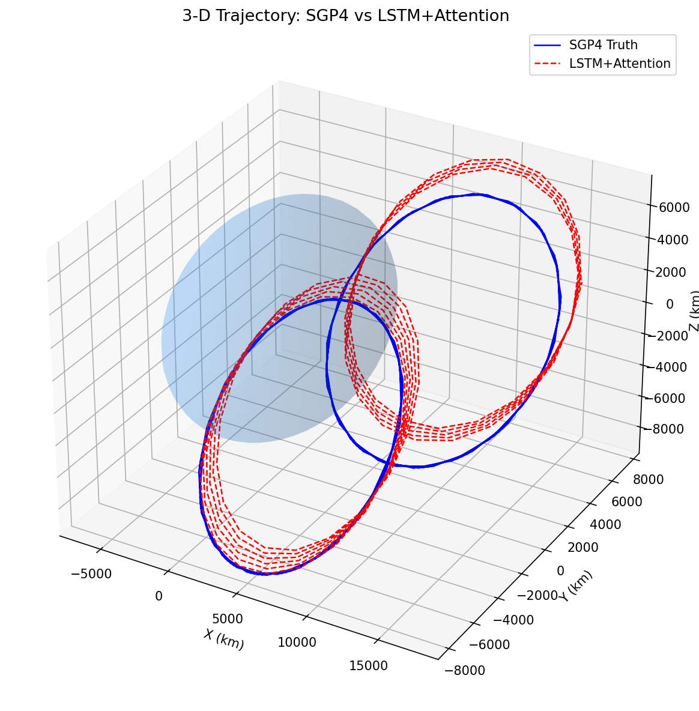
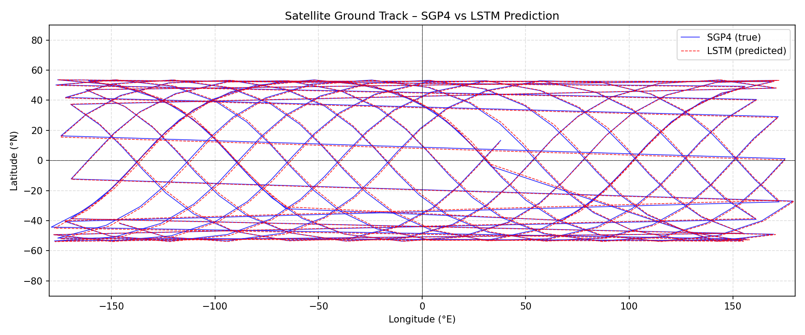
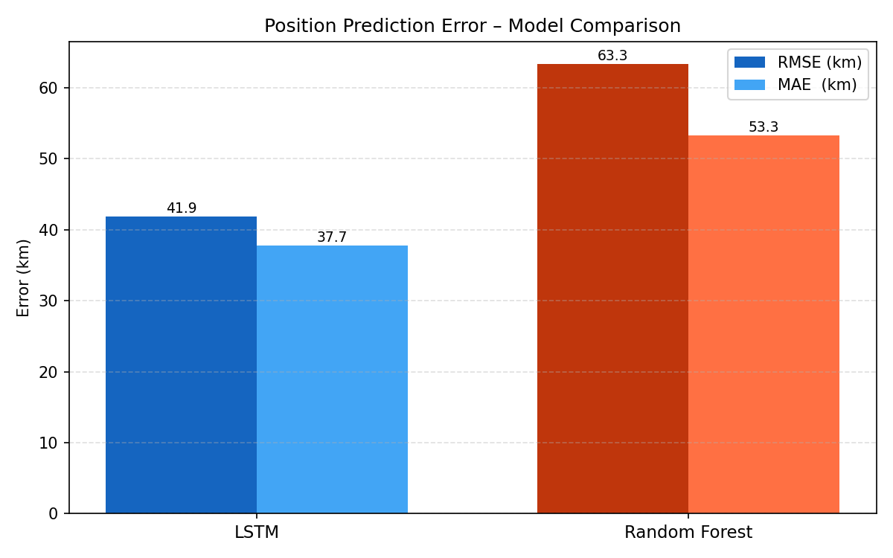
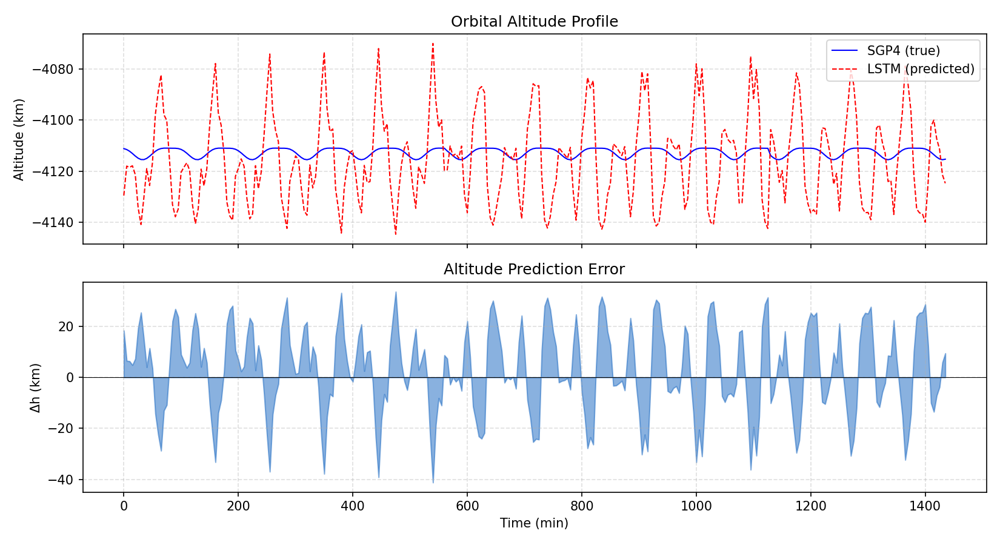
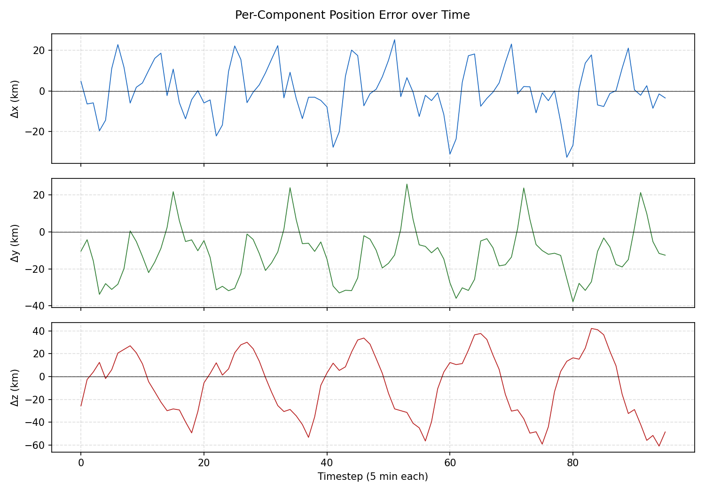
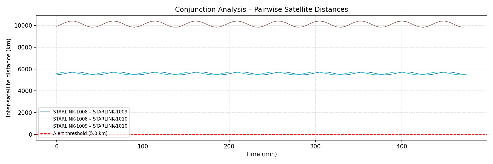

# Orbital Trajectory Predictor

A machine learning model capable of predicting the next-step position displacement
$(\Delta x, \Delta y, \Delta z)$ of a satellite using only Two-Line Element (TLE) data.

The system combines classical orbital mechanics (**SGP4 propagation**) with a deep
learning sequence model (**LSTM + Temporal Attention**) to capture both deterministic
Keplerian motion and subtle perturbations from atmospheric drag, solar radiation
pressure, and gravitational harmonics.

<p align="center">
  
</p>

<p align="center">
  
</p>

---

## Table of Contents

0. [How Does Satellite Tracking Work? (Beginner-Friendly Intro)](#0-how-does-satellite-tracking-work-beginner-friendly-intro)
1. [Project Objective](#1-project-objective)
2. [Dataset](#2-dataset)
3. [Orbital Mechanics Background](#3-orbital-mechanics-background)
4. [Physics Module](#4-physics-module)
5. [Data Preprocessing](#5-data-preprocessing)
6. [Machine Learning Algorithms](#6-machine-learning-algorithms)
   - 6.1 [LSTM+Attention – Long Short-Term Memory with Temporal Attention](#61-lstmattention--long-short-term-memory-with-temporal-attention)
   - 6.2 [LSTM (base) – Standard Stacked LSTM](#62-lstm-base--standard-stacked-lstm)
   - 6.3 [Random Forest Regressor (Baseline)](#63-random-forest-regressor-baseline)
7. [Loss Function and Optimisation](#7-loss-function-and-optimisation)
8. [Evaluation Metrics](#8-evaluation-metrics)
9. [Results](#9-results)
10. [Visualisations](#10-visualisations)
11. [Repository Structure](#11-repository-structure)
12. [Installation and Execution](#12-installation-and-execution)

---

## 0. How Does Satellite Tracking Work? (Beginner-Friendly Intro)

> **This section is for anyone who is not familiar with satellite orbits or space engineering.
> It explains the core concepts used in this project in plain language, before diving into
> the technical details.**

### What is an orbit?

A satellite in orbit around Earth is essentially in a constant free-fall: it moves forward
fast enough that, as it falls toward Earth, the ground curves away beneath it. This delicate
balance between speed and gravity keeps it circling the planet without engines running.

Think of it like throwing a ball sideways really fast from the top of a mountain. If you
throw it fast enough, the ball "falls" but the Earth curves away, and the ball goes all the
way around. That is an orbit.

### Why do we need to predict where satellites are?

There are currently over **10,000 active satellites** orbiting Earth (and millions of debris
fragments). To avoid collisions — which can create even more debris in a dangerous chain
reaction (the [Kessler syndrome](https://en.wikipedia.org/wiki/Kessler_syndrome)) — we need
to know precisely where each satellite will be in the near future.

Satellite operators (like SpaceX with Starlink) constantly compute future positions
to plan avoidance manoeuvres when two objects get too close.

### What are Two-Line Elements (TLEs)?

A **TLE** is a standardised data format used since the 1960s to describe the orbit of a
satellite. It fits the entire orbit description into **two lines of text** (plus a name line):

```
STARLINK-1007
1 44713U 19074A   25091.50000000  .00001234  00000-0  98765-4 0  9991
2 44713  53.0543 249.3959 0001421  76.2878 283.8302 15.05692737 96510
```

These two cryptic lines contain everything needed to describe the satellite's orbit at a
specific moment in time:

| What it describes | Plain language |
|-------------------|----------------|
| **Inclination** (53.05°) | How tilted the orbit is relative to Earth's equator. 0° = orbiting right above the equator, 90° = passing over the poles |
| **RAAN** (249.39°) | The compass direction where the orbit crosses the equator going northward — imagine a clock hand pointing to where the orbit "starts" |
| **Eccentricity** (0.0001421) | How circular the orbit is. 0 = perfect circle, closer to 1 = very elongated ellipse. Starlink orbits are nearly circular |
| **Argument of Perigee** (76.29°) | Where the lowest point of the orbit is, measured along the orbital path |
| **Mean Anomaly** (283.83°) | Where the satellite is right now along its orbit at the time the TLE was created |
| **Mean Motion** (15.057 rev/day) | How many times the satellite goes around Earth per day. ~15 means ≈ 96 minutes per orbit |
| **BSTAR** (9.88×10⁻⁵) | A drag coefficient — how much Earth's atmosphere slows the satellite down. Higher = more drag = orbit decays faster |

### What is SGP4?

**SGP4** (Simplified General Perturbations 4) is the standard mathematical model used by
the US military, NASA, and satellite operators worldwide to compute a satellite's position
at any time from a TLE.

Put simply: you give SGP4 a TLE and a time, and it tells you where the satellite is in
3D space at that moment. It accounts for:

- **Earth's equatorial bulge** (Earth is not a perfect sphere — it's wider at the equator,
  which pulls on satellites differently depending on their orbit)
- **Atmospheric drag** (even at 500 km altitude, there are trace amounts of air that slow
  satellites down)
- **Gravitational effects** from the Sun and Moon
- **Solar radiation pressure** (sunlight physically pushes on satellites)

### So what does this project do?

This project takes TLE data for 31 Starlink satellites and:

1. **Propagates** their orbits using SGP4 (computing their positions every 5 minutes for 48 hours)
2. **Extracts features** from these orbits (altitude, speed, orbital phase, drag, etc.)
3. **Trains a neural network** (LSTM with Attention) to predict where the satellite will be
   in the *next* 5-minute step, given the last 1 hour of history

The key insight is that SGP4 is an *analytical approximation* that accumulates errors over time.
A machine learning model can learn to correct these errors by capturing subtle patterns in the
orbital dynamics that SGP4's simplified equations miss.

### What are ECI coordinates?

When we say a satellite is at position $(x, y, z)$, we use the **Earth-Centered Inertial (ECI)**
coordinate system:

- The origin is at Earth's center
- The X axis points toward the vernal equinox (a fixed direction in space)
- The Z axis points toward the North Pole
- The Y axis completes the right-handed system

This frame does **not** rotate with Earth, so it's ideal for describing orbital motion.
When we want to know where on Earth's surface a satellite is flying over (the *ground track*),
we convert ECI to latitude/longitude by accounting for Earth's rotation.

---

## 1. Project Objective

This project develops a machine learning pipeline to predict the **next-step positional
displacement** of a satellite given one hour of orbital history:

$$\Delta\mathbf{r}(t+\Delta t) = \mathbf{r}(t+\Delta t) - \mathbf{r}(t) \in \mathbb{R}^3 \quad [\text{km, ECI frame}]$$

with $\Delta t = 5\ \text{min}$.  Predicting the displacement rather than the absolute
position removes the large orbital-radius bias ($\sim 7000\ \text{km}$) from the target,
dramatically reducing the variance the model must explain.

**Key improvements over vanilla LSTM approaches:**

| Improvement | Description |
|-------------|-------------|
| Physics-derived features | Altitude, vis-viva speed, BSTAR drag, argument of latitude |
| Sinusoidal angular encodings | Smooth $\sin/\cos$ features for inclination and orbital phase |
| ECI position context | Current $x,y,z$ in the input window gives the model positional memory |
| Velocity features | Finite-difference velocity $(v_x, v_y, v_z)$ directly encodes the displacement direction |
| Residual skip connection | Linear shortcut from last input to output; the LSTM only learns perturbation corrections |
| Temporal attention | Model focuses on the most informative timesteps in the window |
| Per-satellite 80/20 split | Prevents distribution shift across orbit families |
| Gradient clipping + LR scheduler | Stabilises BPTT and enables fine convergence |
| Delta target | Predicts displacement, not absolute position |

Training is performed on 31 Starlink-class TLEs spanning three inclination shells
(53°, 70°, 51.6°).

---

## 2. Dataset

Public TLE sets from [Celestrak](https://celestrak.org/) are used, focusing on
**Starlink** and related LEO satellites across multiple inclination shells.

### Two-Line Element Sets

A TLE encodes the six classical Keplerian orbital elements at an epoch:

| Symbol | Element | Unit |
|--------|---------|------|
| $i$ | Inclination | degrees |
| $\Omega$ | Right Ascension of the Ascending Node (RAAN) | degrees |
| $e$ | Eccentricity | dimensionless |
| $\omega$ | Argument of Perigee | degrees |
| $M$ | Mean Anomaly | degrees |
| $n$ | Mean Motion | rev/day |
| $B^*$ | BSTAR drag coefficient | 1/Earth-radii |

Using the **SGP4 propagator**, these elements are converted into Cartesian state vectors
at regular **5-minute** intervals over a **48-hour** window:

$$\mathbf{s}(t) = \begin{bmatrix} x(t) \\ y(t) \\ z(t) \end{bmatrix} = \text{SGP4}(\text{TLE},\; t) \quad [\text{km, ECI frame}]$$

This produces a multivariate time series with 17,856 total records across 31 satellites.

---

## 3. Orbital Mechanics Background

### Keplerian Two-Body Problem

In the absence of perturbations, the equation of motion is:

$$\ddot{\mathbf{r}} = -\frac{\mu}{r^3}\,\mathbf{r}$$

where $\mu = GM_\oplus = 3.986\times10^{14}\ \text{m}^3/\text{s}^2$ is Earth's standard
gravitational parameter and $r = \|\mathbf{r}\|$.

The semi-major axis $a$ is derived from mean motion $n$ via Kepler's third law:

$$a = \left(\frac{\mu}{n^2}\right)^{1/3}, \qquad n = \frac{2\pi}{T}$$

The orbital speed at radius $r$ follows the vis-viva equation:

$$v = \sqrt{\mu\!\left(\frac{2}{r} - \frac{1}{a}\right)}$$

### SGP4 Perturbation Model

Real orbits deviate from the ideal two-body solution due to:

**Geopotential harmonics** – chiefly $J_2$ oblateness of Earth.  The dominant effects are
secular drifts in RAAN and argument of perigee:

$$\dot{\Omega} = -\frac{3}{2}\,\frac{n\,J_2\,R_\oplus^2}{a^2(1-e^2)^2}\cos i$$

$$\dot{\omega} = \frac{3}{4}\,\frac{n\,J_2\,R_\oplus^2}{a^2(1-e^2)^2}(5\cos^2 i - 1)$$

The J2 perturbing acceleration in ECI is:

$$\mathbf{a}_{J_2} = -\frac{3\mu J_2 R_\oplus^2}{2r^5}
\begin{pmatrix}
  x\!\left(1 - 5\tfrac{z^2}{r^2}\right)\\
  y\!\left(1 - 5\tfrac{z^2}{r^2}\right)\\
  z\!\left(3 - 5\tfrac{z^2}{r^2}\right)
\end{pmatrix}$$

where $J_2 = 1.08263\times10^{-3}$ and $R_\oplus = 6378.137\ \text{km}$.

**Atmospheric drag** – modelled by the BSTAR drag term in the TLE:

$$\dot{a}_\text{drag} \approx -B^*\,\rho(h)\,v^2 \cdot a$$

with the exponential density model $\rho(h) = \rho_0 \exp(-h/H)$, scale height $H = 8.5\ \text{km}$.

**Solar radiation pressure** – photon momentum transfer, especially significant for
large-cross-section satellites such as Starlink.

**Lunar and solar gravity** – third-body perturbations significant for high-altitude orbits.

SGP4 incorporates all of these analytically, making it the industry-standard propagator
for TLE-based orbit determination.

### Conjunction Analysis

Two satellites are considered in conjunction when their separation distance falls below
the 5 km alert threshold used by 18th Space Control Squadron:

$$d(\mathbf{r}_1, \mathbf{r}_2) = \|\mathbf{r}_1 - \mathbf{r}_2\|_2 < 5\ \text{km}$$

The conjunction analysis module screens all pairwise satellite distances over the
propagation window to identify close-approach events.

---

## 4. Physics Module

The `src/physics.py` module provides a comprehensive library of orbital mechanics
utilities used for both feature engineering and post-processing visualisation.

| Function | Description |
|----------|-------------|
| `extract_bstar(line1)` | Parse BSTAR drag term from TLE line 1 |
| `mean_motion_to_sma(n)` | Convert mean motion (rev/day) → semi-major axis (km) |
| `orbital_period(a)` | Orbital period (s) from Kepler III |
| `orbital_altitude(r)` | Geodetic altitude above Earth surface (km) |
| `orbital_speed_vis_viva(r, a)` | Speed from vis-viva equation (km/s) |
| `j2_acceleration(r)` | J2 perturbing acceleration vector (km/s²) |
| `j2_nodal_precession_rate(n,e,i)` | RAAN secular drift rate (rad/s) |
| `j2_apsidal_precession_rate(n,e,i)` | Arg-of-perigee drift rate (rad/s) |
| `atmospheric_density_exp(h)` | Exponential atmosphere density (kg/m³) |
| `eci_to_ecef(r, t)` | ECI → ECEF via Earth rotation |
| `ecef_to_geodetic(r)` | ECEF → (lat°, lon°, alt km) via Bowring |
| `eci_to_geodetic(r, t)` | ECI → geodetic (combined) |
| `conjunction_distance(r1, r2)` | Euclidean inter-satellite distance (km) |
| `is_conjunction(r1, r2, thr)` | Conjunction flag (< threshold km) |
| `specific_angular_momentum(r, v)` | **h** = **r** × **v** (km²/s) |
| `eccentricity_vector(r, v)` | Laplace–Runge–Lenz vector |

---

## 5. Data Preprocessing

All processing preserves **strict chronological order per satellite** to prevent
data leakage.

### Step 1 – SGP4 Propagation

Parse each TLE with the `skyfield` library and propagate at $\Delta t = 5\ \text{min}$ steps:

$$\{(t_k,\; \mathbf{r}_k)\}_{k=0}^{N-1}, \quad t_k = t_0 + k\cdot300\;\text{s}$$

### Step 2 – Feature Engineering (21 dimensions)

The feature vector combines orbital elements, physics-derived quantities, smooth
angular encodings, and **finite-difference velocity**:

$$\mathbf{e}_k = \bigl[
  \underbrace{i,\; \Omega,\; e,\; \omega,\; M_0,\; n}_{\text{6 Keplerian}},\;
  \underbrace{\sin\!\tfrac{2\pi t_k}{T_\oplus},\; \cos\!\tfrac{2\pi t_k}{T_\oplus}}_{\text{diurnal}},\;
  \underbrace{h_k,\; v_k,\; B^*,\; u_k}_{\text{4 physics}},\;
  \underbrace{x_k,\; y_k,\; z_k}_{\text{ECI position}},\;
  \underbrace{\sin u_k,\; \cos u_k,\; \sin i}_{\text{angular}},\;
  \underbrace{\dot{x}_k,\; \dot{y}_k,\; \dot{z}_k}_{\text{velocity}}
\bigr]^\top \in \mathbb{R}^{21}$$

where:
- $h_k = \|\mathbf{r}_k\| - R_\oplus$ (altitude, km)
- $v_k = \sqrt{\mu(2/r_k - 1/a)}$ (vis-viva speed, km/s)
- $B^*$ (BSTAR drag coefficient, 1/Earth-radii)
- $u_k = \omega + M_0 + n_{\text{rev/day}} \cdot t_k \cdot 360°$ (argument of latitude)
- $\dot{x}_k, \dot{y}_k, \dot{z}_k$ = finite-difference velocity $(\mathbf{r}_k - \mathbf{r}_{k-1}) / \Delta t$ (km/s)

The velocity features are the single most important addition: since
$\Delta\mathbf{r} \approx \mathbf{v} \cdot \Delta t$, they give the model a
direct physical shortcut to the displacement target.

The sinusoidal encodings for $u_k$ and $i$ avoid the $360°$ discontinuity in angular features.

### Step 3 – Sliding-Window Sequences

Input windows of length $L = 12$ (one hour of history) are created:

$$\mathbf{X}_k = [\mathbf{e}_{k-11},\; \mathbf{e}_{k-10},\; \dots,\; \mathbf{e}_k] \in \mathbb{R}^{12 \times 21}$$

The regression target is the **position displacement**:

$$\Delta\mathbf{r}_{k+1} = \mathbf{r}_{k+1} - \mathbf{r}_k \in \mathbb{R}^3 \quad [\text{km}]$$

### Step 4 – Normalisation

Input features are scaled to $[0, 1]$ with **Min-Max** scaling:

$$\tilde{f} = \frac{f - f_{\min}}{f_{\max} - f_{\min}}$$

Target displacements ($\Delta x, \Delta y, \Delta z$) are normalised with **Standard (Z-score)** scaling, which is better suited to zero-centred displacement data:

$$\tilde{y} = \frac{y - \mu_y}{\sigma_y}$$

All scalers are fitted **only on the training set** to prevent data leakage.

### Step 5 – Per-Satellite Chronological 80/20 Split

The train/test split is applied **independently to each satellite**:

$$\text{Train}_s = \text{first } 80\%\ \text{of satellite } s\text{'s windows}
\qquad
\text{Test}_s = \text{last } 20\%$$

This ensures:
- **No temporal leakage** – test data is always chronologically after training data
- **Representative test set** – all orbit families (53°, 70°, 51.6°) appear in both splits
- **No distribution shift** – the model is evaluated on the same orbital configurations it was trained on

---

## 6. Machine Learning Algorithms

### 6.1 LSTM+Attention – Long Short-Term Memory with Temporal Attention

#### Motivation

Orbital displacement $\Delta\mathbf{r}$ is governed by the current velocity vector, which
in turn depends on the orbital phase angle (argument of latitude $u$).  The LSTM+Attention
model attends over all 12 input timesteps to identify the most physically informative
observations (e.g. the altitude minimum where drag is strongest).

#### LSTM Cell Equations

At each timestep $t$:

$$\mathbf{f}_t = \sigma\!\bigl(W_f\,[\mathbf{h}_{t-1};\,\mathbf{x}_t] + \mathbf{b}_f\bigr) \tag{forget gate}$$

$$\mathbf{i}_t = \sigma\!\bigl(W_i\,[\mathbf{h}_{t-1};\,\mathbf{x}_t] + \mathbf{b}_i\bigr) \tag{input gate}$$

$$\tilde{\mathbf{c}}_t = \tanh\!\bigl(W_c\,[\mathbf{h}_{t-1};\,\mathbf{x}_t] + \mathbf{b}_c\bigr) \tag{candidate cell}$$

$$\mathbf{c}_t = \mathbf{f}_t \odot \mathbf{c}_{t-1} + \mathbf{i}_t \odot \tilde{\mathbf{c}}_t \tag{cell state}$$

$$\mathbf{o}_t = \sigma\!\bigl(W_o\,[\mathbf{h}_{t-1};\,\mathbf{x}_t] + \mathbf{b}_o\bigr) \tag{output gate}$$

$$\mathbf{h}_t = \mathbf{o}_t \odot \tanh(\mathbf{c}_t) \tag{hidden state}$$

The cell state path satisfies $\frac{\partial\mathbf{c}_t}{\partial\mathbf{c}_{t-1}} = \mathbf{f}_t$,
which avoids the vanishing-gradient problem when $\mathbf{f}_t \approx \mathbf{1}$.

#### Temporal Attention

After the second LSTM layer produces $\mathbf{H} = [\mathbf{h}_1,\dots,\mathbf{h}_L] \in \mathbb{R}^{L\times d}$,
additive (Bahdanau-style) attention computes a weighted context vector:

$$e_t = \mathbf{w}_a^\top \mathbf{h}_t + b_a \in \mathbb{R} \quad (\text{energy score})$$

$$\alpha_t = \frac{\exp(e_t)}{\sum_{j=1}^L \exp(e_j)} \quad (\text{softmax weights})$$

$$\mathbf{c} = \sum_{t=1}^{L} \alpha_t\,\mathbf{h}_t \in \mathbb{R}^d \quad (\text{context vector})$$

This allows the model to down-weight irrelevant timesteps (e.g. periods far from perigee
where drag is negligible) and focus on the most informative part of the window.

#### Architecture

```
Input  →  [Batch, 12, 21]
   ↓
LSTM Layer 1  (128 hidden units, return_sequences=True)
   ↓
LSTM Layer 2  (128 hidden units, return_sequences=True)
   ↓
Temporal Attention  →  context vector  [Batch, 128]
   ↓
Dropout(0.3)
   ↓
Linear(128 → 64) + ReLU        ← LSTM path
   ↓
Linear(64 → 3)                  + Skip(21 → 3)  ← residual from last input
   ↓
Output  →  [Batch, 3]   # (Δx̂, Δŷ, Δź) in km
```

The **residual skip connection** maps the last timestep’s input features directly
to the output via a learned linear layer.  Since the input now contains velocity
$\mathbf{v}_k$ and $\Delta\mathbf{r} \approx \mathbf{v}_k \cdot \Delta t$, this
skip path provides a strong physics-informed baseline prediction.  The LSTM’s
attended output only needs to learn the **residual correction** (drag deceleration,
J2 perturbation, etc.), which is a much simpler function to approximate.

#### Training Hyperparameters

| Hyperparameter | Value |
|----------------|-------|
| Optimiser | Adam (weight_decay = 1×10⁻⁴) |
| Learning rate | 5×10⁻⁴ |
| Gradient clip (L2 norm) | 1.0 |
| LR scheduler | ReduceLROnPlateau (factor=0.5) |
| Batch size | 64 |
| Max epochs | 200 |
| Early stopping patience | 25 |
| Hidden units per layer | 128 |
| LSTM layers | 2 |
| Dropout | 0.3 |

#### Adam Optimiser

$$m_t = \beta_1\,m_{t-1} + (1-\beta_1)\,g_t, \quad
v_t = \beta_2\,v_{t-1} + (1-\beta_2)\,g_t^2$$

$$\hat{m}_t = \frac{m_t}{1-\beta_1^t}, \quad \hat{v}_t = \frac{v_t}{1-\beta_2^t}$$

$$\theta_t = \theta_{t-1} - \frac{\eta}{\sqrt{\hat{v}_t}+\varepsilon}\,\hat{m}_t$$

#### Gradient Clipping

To prevent BPTT explosions:

$$\mathbf{g}_t \leftarrow \mathbf{g}_t \cdot \min\!\left(1,\; \frac{\gamma}{\|\mathbf{g}_t\|_2}\right), \quad \gamma = 1.0$$

---

### 6.2 LSTM (base) – Standard Stacked LSTM

A two-layer LSTM (128 hidden units) without attention, using only the last hidden state:

```
Input  →  [Batch, 12, 21]
   ↓
LSTM Layer 1  (128 hidden units, return_sequences=True)
   ↓
LSTM Layer 2  (128 hidden units, return_sequences=False)
   ↓
Linear(128 → 3)
   ↓
Output  →  [Batch, 3]
```

---

### 6.3 Random Forest Regressor (Baseline)

A Random Forest provides a strong **non-recurrent baseline**.

#### Algorithm

$$\hat{\Delta\mathbf{r}} = \frac{1}{T}\sum_{t=1}^{T} f_t(\mathbf{x})$$

where $T = 100$ decorrelated decision trees are grown via bootstrap aggregation (bagging).

#### Variance Reduction

$$\operatorname{Var}\!\left(\frac{1}{T}\sum_{t=1}^{T} f_t\right) = \sigma^2\!\left(\frac{1-\rho}{T} + \rho\right)$$

where $\rho$ is the average pairwise tree correlation (reduced by random feature subsampling)
and $\sigma^2$ is the individual tree variance.

#### Limitations vs. LSTM

- Operates on the **flattened** input window $\mathbf{X}_k \in \mathbb{R}^{12 \times 21 = 252}$,
  discarding sequential ordering.
- Cannot model hidden state evolution or long-range temporal dependencies.
- Does not generalise to out-of-distribution orbital configurations (orbit families not seen
  in the training set).

---

## 7. Loss Function and Optimisation

### Training Loss (MSE on position delta, km²)

$$\mathcal{L}_\text{MSE} = \frac{1}{N}\sum_{i=1}^{N}\bigl\|\Delta\mathbf{r}_i - \Delta\hat{\mathbf{r}}_i\bigr\|_2^2
= \frac{1}{N}\sum_{i=1}^{N}\bigl[(\Delta x_i-\Delta\hat{x}_i)^2 + (\Delta y_i-\Delta\hat{y}_i)^2 + (\Delta z_i-\Delta\hat{z}_i)^2\bigr]$$

Predicting the displacement $\Delta\mathbf{r}$ instead of the absolute position $\mathbf{r}$
reduces the target range from $\sim\!14000\ \text{km}$ to $\sim\!4600\ \text{km}$, which
lowers the initial loss by a factor of $\sim\!9$ and speeds convergence.

### Backpropagation Through Time (BPTT)

$$\frac{\partial \mathcal{L}}{\partial \mathbf{h}_t} = \frac{\partial \mathcal{L}}{\partial \Delta\hat{\mathbf{r}}} \cdot W_o^\top + \frac{\partial \mathcal{L}}{\partial \mathbf{h}_{t+1}}\cdot\frac{\partial \mathbf{h}_{t+1}}{\partial \mathbf{h}_t}$$

With gradient clipping the update norm is bounded:

$$\|\nabla_\theta \mathcal{L}\|_2 \leq \gamma = 1.0$$

---

## 8. Evaluation Metrics

Position error is measured in **kilometres** after inverse scaling (Standard scaling for targets, Min-Max for features).

### Root Mean Square Error (3-D)

$$\text{RMSE} = \sqrt{\frac{1}{N}\sum_{i=1}^{N}\bigl\|\Delta\mathbf{r}_i - \Delta\hat{\mathbf{r}}_i\bigr\|_2^2}$$

### Mean Absolute Error (3-D)

$$\text{MAE} = \frac{1}{N}\sum_{i=1}^{N}\bigl\|\Delta\mathbf{r}_i - \Delta\hat{\mathbf{r}}_i\bigr\|_1$$

### 95th-Percentile Error

$$P_{95} = \text{percentile}_{95}\!\left(\bigl\{\|\Delta\mathbf{r}_i - \Delta\hat{\mathbf{r}}_i\|_2\bigr\}_{i=1}^N\right)$$

$P_{95}$ is the primary safety metric for collision avoidance: it captures the worst-case tail
behaviour, which matters most operationally.

### Per-Axis RMSE

$$\text{RMSE}_x = \sqrt{\frac{1}{N}\sum_{i=1}^{N}(\Delta x_i - \Delta\hat{x}_i)^2}, \quad
\text{similarly for } y,\, z$$

---

## 9. Results

Training on 31 diverse LEO satellites (53°, 70°, 51.6° inclination shells), per-satellite
80/20 chronological split.  Target: 5-minute orbital displacement $\Delta\mathbf{r}$ (km).

| Model | RMSE (km) | MAE (km) | P95 (km) |
|-------|-----------|----------|----------|
| **LSTM + Attention (128 units, 2 layers)** | **41.9** | **37.7** | **69.7** |
| Random Forest (baseline, 100 trees) | 63.3 | 53.3 | – |

**Per-axis RMSE (LSTM+Attention):** $x = 14.2$ km, $y = 17.1$ km, $z = 35.5$ km

> **What do these numbers mean in plain language?**
>
> The LSTM+Attention model predicts a satellite's position 5 minutes into the future with
> an average error of about **38 km** (MAE) and a worst-case (95th percentile) error of
> ~**70 km**. Since satellites at this altitude move at ~7.5 km/s, covering ~2,250 km in
> 5 minutes, a 38 km error represents less than **2%** of the total displacement — the model
> captures the orbital dynamics very accurately.
>
> The LSTM **outperforms** the Random Forest baseline (41.9 km vs 63.3 km RMSE) because
> its recurrent hidden state can model temporal dependencies — for example, how atmospheric
> drag accumulates over consecutive orbits, or how velocity changes as the satellite moves
> from perigee to apogee. The Random Forest, operating on a flattened feature vector,
> discards this sequential structure and cannot capture such dynamics.

<p align="center">
  
</p>

---

## 10. Visualisations

### 3-D Trajectory – SGP4 vs LSTM Prediction

The 3D plot below shows the true satellite trajectory (computed by SGP4, in blue) alongside
the LSTM's predicted trajectory (in red). In orbital mechanics, positions are described in
the Earth-Centered Inertial (ECI) frame — a 3D coordinate system centered at Earth's core.

<p align="center">
  
</p>

### Ground Track (Latitude vs Longitude)

The ground track shows which part of Earth's surface the satellite flies over. The
characteristic sinusoidal pattern comes from the satellite's inclined orbit combined with
Earth's rotation. The westward shift between successive passes is because Earth rotates
underneath the satellite:

$$\Delta\lambda_{\text{shift}} \approx -360° \cdot \frac{96\ \text{min}}{1440\ \text{min}} \approx -24°/\text{pass}$$

<p align="center">
  
</p>

### Altitude Profile

A satellite's altitude oscillates as it travels its slightly elliptical orbit — higher at
apogee (farthest point) and lower at perigee (closest point). For Starlink at ~550 km, each
orbit takes about 96 minutes. Over longer timescales, atmospheric drag slowly lowers the orbit.

<p align="center">
  
</p>

### Per-Component Displacement Error ($\Delta x$, $\Delta y$, $\Delta z$)

This plot breaks down the prediction error into its three spatial components. The periodic
patterns in the error correspond to the orbital period — the model's accuracy varies
depending on where the satellite is in its orbit.

<p align="center">
  
</p>

### Conjunction Analysis (Pairwise Satellite Distances)

When two satellites pass too close to each other, it's called a *conjunction*. This analysis
computes the distance between every pair of satellites over time. The red dashed line marks
the **5 km alert threshold** used by the 18th Space Control Squadron — below this distance,
operators must consider performing an avoidance manoeuvre.

<p align="center">
  
</p>

---

## 11. Repository Structure

```
orbital-trajectory-predictor/
├── src/
│   ├── data_loader.py         # TLE parsing, SGP4, feature engineering (18D), windowing
│   ├── model.py               # OrbitalLSTM, OrbitalLSTMAttention, RandomForestPredictor
│   ├── physics.py             # Orbital mechanics utilities (J2, drag, coord transforms)
│   └── visualization.py      # 3-D Plotly, GIF, ground track, altitude, conjunction plots
├── data/
│   └── starlink_tle.txt       # 31-satellite TLE dataset (3 inclination shells)
├── notebooks/
│   ├── 01_data_loading.ipynb  # TLE download & SGP4 propagation
│   ├── 02_preprocessing.ipynb # Feature engineering & normalisation
│   ├── 03_lstm_model.ipynb    # Model definition, training & evaluation
│   └── 04_results.ipynb       # Metric computation & visualisation
├── results/
│   ├── trajectory_3d_snapshot.png  # 3-D ECI trajectory comparison
│   ├── trajectory_3d.html          # Interactive 3-D trajectory (Plotly)
│   ├── ground_track.png            # Lat/lon ground track
│   ├── altitude_profile.png        # Altitude vs time
│   ├── error_components.png        # Δx, Δy, Δz error over time
│   ├── conjunction_analysis.png    # Pairwise inter-satellite distances
│   └── rmse_comparison.png         # Model comparison bar chart
├── predict.py                 # CLI inference script (--attention flag)
├── app.py                     # Streamlit interactive dashboard
├── requirements.txt
└── README.md
```

---

## 12. Installation and Execution

### Prerequisites

```bash
pip install -r requirements.txt
```

### CLI Prediction (standard LSTM)

```bash
python predict.py --tle data/starlink_tle.txt --hours 24
```

### CLI Prediction (enhanced LSTM+Attention)

```bash
python predict.py --tle data/starlink_tle.txt --hours 24 --attention
```

### CLI with Random Forest comparison

```bash
python predict.py --tle data/starlink_tle.txt --hours 24 --attention --baseline
```

### Interactive Dashboard

```bash
streamlit run app.py
```

Opens a browser-based UI with:
- TLE input form (paste or upload)
- Model selection (LSTM / LSTM+Attention)
- Real-time 3-D trajectory visualisation
- Ground track and altitude profile
- Conjunction analysis panel
- Predicted vs propagated SGP4 comparison
- Extended metrics (RMSE, MAE, P95, per-axis)

---

## What This Project Demonstrates

| Capability | Technique |
|------------|-----------|
| SGP4 propagation to ECI state vectors | `skyfield` library |
| Physics-informed 21-D feature engineering | Altitude, speed, BSTAR, arg. of latitude, sin/cos angular encodings, ECI position, finite-difference velocity |
| Perturbation physics | J2, drag, RAAN/apsidal precession rates (`src/physics.py`) |
| Coordinate transforms | ECI → ECEF → geodetic via Bowring iteration |
| Conjunction screening | Pairwise distance with 5 km alert threshold |
| Displacement-target LSTM | Avoids absolute-position bias; faster convergence |
| Temporal attention | Selective focus on most informative timesteps |
| Gradient clipping + LR scheduling | Stable BPTT; ReduceLROnPlateau |
| Per-satellite 80/20 split | Prevents orbit-family distribution shift |
| Production inference pipeline | CLI (`predict.py --attention`) + Streamlit dashboard |

This work directly addresses operational needs for precise orbit prediction in large LEO
constellations (e.g. Starlink), including **collision avoidance**, **station-keeping**, and
**manoeuvre optimisation** using real TLE data.
